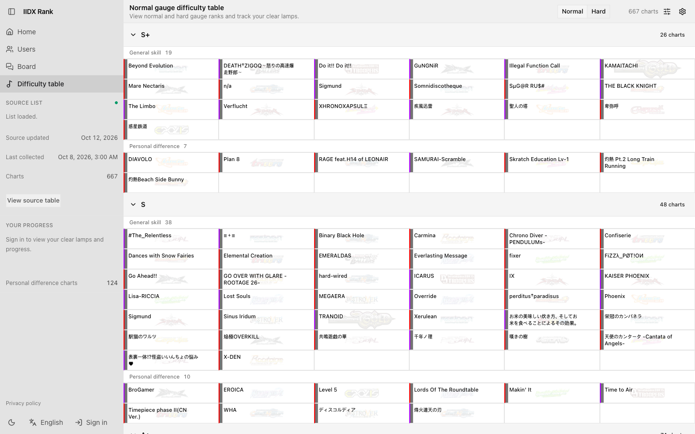

<div align="center">


# IIDX Rank

**A beatmania IIDX SP ☆12 difficulty table that keeps your clear lamps, scores and notes next to every chart.**

[Open IIDX Rank](https://iidx.hyns.dev) · [Chrome extension](https://chromewebstore.google.com/detail/iidx-data-parser/ihhbemlpcommigeghkpfahgncipbikmk) · [Extension source](https://github.com/B-HS/iidx-rank-data-parser) · [Importing](#importing-from-e-amusement) · [Development](#development)

</div>



IIDX Rank reads a published Google Sheets difficulty table for beatmania IIDX SP level 12 and turns it into a dense, filterable board: every chart sits in its normal gauge or hard gauge rank, and charts marked as personal difference in the source are kept apart. Sign in and each card carries your own clear lamp, DJ LEVEL and notes; bring your play data over from e-amusement with the companion extension and the home dashboard, your profile and the table all fill in from it. The table itself is public and needs no account.

IIDX Rank is an unofficial fan project and is not affiliated with KONAMI.

## Features

- **Difficulty table** — SP ☆12 charts grouped from S+ down to F by normal gauge or hard gauge rank, with general-skill and personal-difference charts separated inside each rank and collapsible rank sections
- **Filters** — search by title and narrow by difficulty (HYPER, ANOTHER, LEGGENDARIA), version, rank, personal difference only or unplayed only
- **Clear lamps and notes** — click a card to step its lamp, hold it to open the record and set the clear lamp, DJ LEVEL and a private note; a click cycles EASY and CLEAR in normal gauge mode or HARD and EX HARD in hard gauge mode, and never lowers a higher lamp
- **Home dashboard** — your profile and e-amusement player info, notes radar, lamp totals with DJ LEVEL distribution, lamps per rank, recently played charts and board activity on one screen; guests see the state of the table, notices and recent posts instead
- **Profiles and follow** — a page per player at `/u/<handle>` with lamp summary, play records, DJ NAME, dan rank and notes radar; profiles are private until you make them public, and public players are listed by most recent record update
- **Board** — posts and comments with a rich text editor and images, notices pinned on top, and a block list that hides another user's posts and comments
- **e-amusement import** — lamps, DJ LEVEL, EX SCORE and MISS COUNT for SP level 12 charts, plus DJ NAME, dan rank and notes radar, through the IIDX Data Parser extension or a `rank-import` v2 JSON file; every change is kept as history and your notes are preserved
- **Sign-in** — email and password, GitHub or Naver
- **Display settings** — show each chart's version as a logo or as a name and adjust logo opacity; saved to your account, or to the browser for guests
- **Themes** — light and dark
- **Localized** — English · 한국어 · 日本語

## Importing from e-amusement

1. Install [IIDX Data Parser](https://chromewebstore.google.com/detail/iidx-data-parser/ihhbemlpcommigeghkpfahgncipbikmk) from the Chrome Web Store. It runs on Chromium-based desktop browsers.
2. Sign in to IIDX Rank and to e-amusement in the same browser.
3. Collect your play data with the extension. It opens the IIDX Rank import screen, which uploads the data with your signed-in account and shows the charts that changed.

Without the extension, open **Profile settings** and upload a `rank-import` v2 JSON file exported by IIDX Data Parser. Only SP data is imported, and only chart records that are in the level 12 table are stored. What the site and the extension handle is described in the [privacy policy](https://iidx.hyns.dev/en/privacy).

## Development

```sh
bun install --frozen-lockfile
bun run db:migrate    # apply Drizzle migrations to the local SQLite file
bun run source:sync   # fetch the published difficulty table into the database
bun run dev
```

```sh
bun run typecheck
bun run lint
bun test
bun run build && bun run start
```

The public table works without any configuration. Accounts and personal records need `BETTER_AUTH_SECRET`. Set variables in `.env.local` for Next.js; the Bun scripts read the same variables from their environment.

| Variable                                     | Purpose                                                                                  |
| -------------------------------------------- | ---------------------------------------------------------------------------------------- |
| `DATABASE_URL`                               | Database location. Defaults to a local SQLite file; production uses Turso                |
| `TURSO_AUTH_TOKEN`                           | Turso access token. Not needed for local SQLite                                          |
| `BETTER_AUTH_URL`                            | Origin the app is served from. Match it when you run on another port or domain           |
| `BETTER_AUTH_SECRET`                         | Session secret, 32 characters or more. Without it only the public table is available     |
| `ADMIN_BOOTSTRAP_EMAILS`                     | Comma-separated emails that receive the admin role, which allows a manual source refresh |
| `CRON_SECRET`                                | Bearer secret for the scheduled source sync endpoint                                     |
| `R2_ACCESS_KEY` · `R2_SECRET_KEY` · `R2_URL` | Cloudflare R2 storage for profile pictures and board images                              |
| `GITHUB_CLIENT_ID` · `GITHUB_SECRET_KEY`     | GitHub sign-in. The button appears only when both are set                                |
| `NAVER_CLIENT_ID` · `NAVER_SECRET_KEY`       | Naver sign-in. The button appears only when both are set                                 |
| `EXTENSION_ORIGINS`                          | Optional comma-separated `chrome-extension://` origins allowed to post imports directly  |

Next.js 16 App Router with Cache Components (`use cache`, partial prerendering), React 19 with React Compiler, Tailwind CSS 4, shadcn/ui, TanStack Query, next-intl and better-auth, with Bun as the package manager, script runner and test runner. Data goes through Drizzle ORM to SQLite locally and Turso in production. The source table is collected once a day by a Vercel Cron job or by an admin from the table sidebar, never during a build or a page request; a failed fetch or parse keeps the last good snapshot. The code follows a Feature-Sliced layout under `src/` (`app`, `widgets`, `features`, `entities`, `shared`).

Contracts and decision records live in [docs/](docs) (Korean): [data and API](docs/ARCHITECTURE.md), [caching](docs/CACHE.md), [e-amusement import](docs/E-AMUSEMENT.md), [community features](docs/COMMUNITY.md), [design](docs/DESIGN.md) and [deployment](docs/DEPLOYMENT.md).
